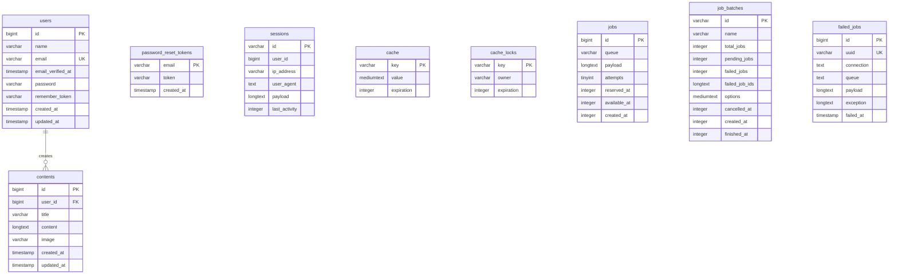

# Database ERD

```mermaid
erDiagram
    users ||--o{ contents : creates

    users {
        bigint id PK
        varchar name
        varchar email UK
        timestamp email_verified_at
        varchar password
        varchar remember_token
        timestamp created_at
        timestamp updated_at
    }

    contents {
        bigint id PK
        bigint user_id FK
        varchar title
        longtext content
        varchar image
        timestamp created_at
        timestamp updated_at
    }

    password_reset_tokens {
        varchar email PK
        varchar token
        timestamp created_at
    }

    sessions {
        varchar id PK
        bigint user_id
        varchar ip_address
        text user_agent
        longtext payload
        integer last_activity
    }

    cache {
        varchar key PK
        mediumtext value
        integer expiration
    }

    cache_locks {
        varchar key PK
        varchar owner
        integer expiration
    }

    jobs {
        bigint id PK
        varchar queue
        longtext payload
        tinyint attempts
        integer reserved_at
        integer available_at
        integer created_at
    }

    job_batches {
        varchar id PK
        varchar name
        integer total_jobs
        integer pending_jobs
        integer failed_jobs
        longtext failed_job_ids
        mediumtext options
        integer cancelled_at
        integer created_at
        integer finished_at
    }

    failed_jobs {
        bigint id PK
        varchar uuid UK
        text connection
        text queue
        longtext payload
        longtext exception
        timestamp failed_at
    }
```
